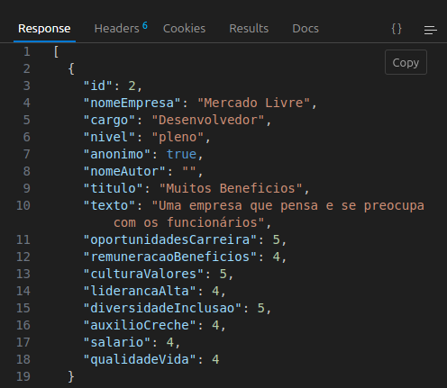

# API de Avaliação de Ambientes de Trabalho

## Descrição
Esta API permite que mulheres avaliem e compartilhem suas experiências em diferentes ambientes de trabalho, ajudando outras mulheres a encontrar locais mais inclusivos e acolhedores. As avaliações podem ser feitas de forma anônima ou identificada, e incluem classificações em várias categorias, como oportunidades de carreira, remuneração e benefícios, cultura e valores, entre outras.

## Tecnologias Usadas
- **Node.js**
- **NestJS**
- **TypeORM**
- **PostgreSQL**
- **SQLite (para testes)**
- **class-validator** (para validações)

## Funcionalidades
- **Cadastro de Avaliações**: Permite criar avaliações com informações sobre a empresa, cargo, nível, e uma classificação detalhada em várias categorias.
- **Listagem de Avaliações**: Recupera todas as avaliações cadastradas na base de dados.
- **Pesquisa por Empresa**: Filtra avaliações com base no nome da empresa.
- **Remoção de Avaliações**: Permite a remoção de uma avaliação específica por ID, retornando uma mensagem de confirmação.
- **Validação de Dados**: Garante que as avaliações contenham valores válidos para as classificações (de 1 a 5).

## Como Rodar o Projeto

### 1. Clone o Repositório
Primeiro, clone o repositório do projeto para a sua máquina local:
```bash
git clone git@github.com:MayaraRocha95/avaliacao-ambientes-trabalho.git
```

## Installation

```bash
$ npm install
```
## Configure o Banco de Dados

####  Configure o Banco de Dados Se você estiver utilizando PostgreSQL para rodar o projeto em produção: 
* Crie um banco de dados no PostgreSQL.
 * Configure as credenciais de conexão no arquivo `app.module.ts` ou em um arquivo `.env` (se houver suporte).


 #### Para rodar o projeto em ambiente de testes, utilizando SQLite em memória:
 * Não são necessárias configurações adicionais, o projeto já está preparado para utilizar SQLite em memória.

 ## Execute o Projeto

#### Rode o servidor NestJS:

```
npm run start:dev
```

#### O servidor estará rodando em http://localhost:3000.


## Teste os Endpoints

   * POST /avaliacoes: Cria uma nova avaliação.
   * GET /avaliacoes: Retorna todas as avaliações.
   * GET /avaliacoes/pesquisa?nomeEmpresa=NomeDaEmpresa: Busca avaliações por nome da empresa.
    

   * DELETE /avaliacoes/
   * Remove uma avaliação pelo ID.


## Deploy do Projeto

O backend do projeto foi inicialmente implantado no [Railway](https://railway.app/), uma plataforma que facilita a implantação de aplicações Node.js e fornece suporte integrado para banco de dados PostgreSQL. Após a configuração e deploy no Railway, a API foi também implantada na [Vercel](https://vercel.com/), que permite a execução de APIs serverless.

### Como o Deploy foi Realizado

1. **Deploy no Railway**: O projeto foi primeiro configurado e implantado no Railway, que cuidou da configuração do ambiente e do banco de dados PostgreSQL. O Railway gerencia o servidor Node.js onde a API está rodando e fornece uma URL pública para acesso.

2. **Deploy na Vercel**: Em seguida, a mesma API foi implantada na Vercel, aproveitando as funcionalidades de serverless oferecidas pela plataforma. A Vercel facilita a implantação de APIs, permitindo que elas sejam acessadas de forma rápida e escalável. A Vercel foi configurada para apontar para o código-fonte da API, e o deploy foi realizado diretamente a partir do repositório.

### Demonstração

Você pode acessar uma demonstração da API em funcionamento clicando [**aqui**](https://avaliacao-ambientes-trabalho.vercel.app/avaliacoes).


 #####  Projeto Criado por Mayara Rocha 💜
